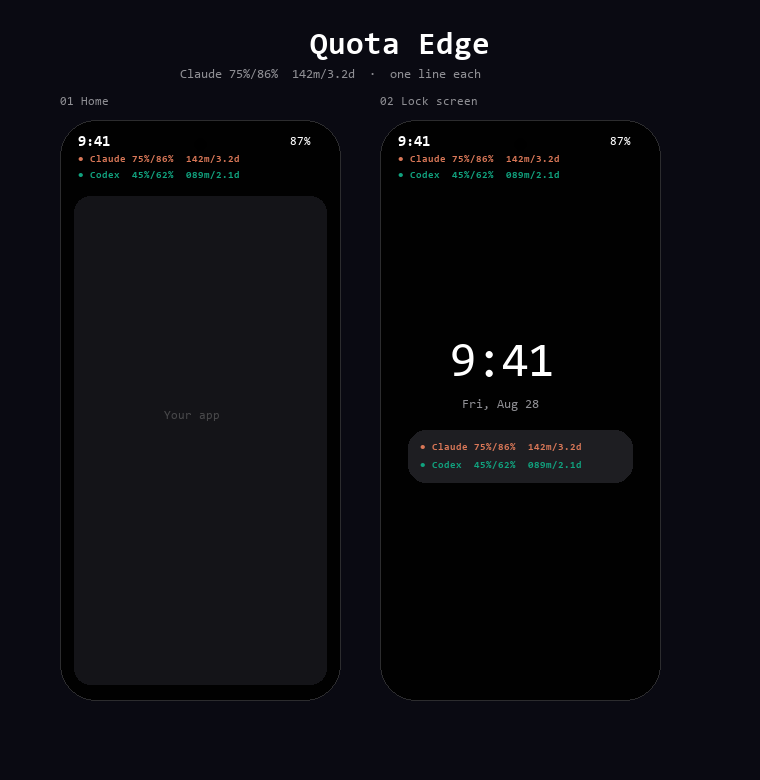

# Quota Edge

**Galaxy-native Claude & Codex usage monitor** — transparent HUD under the clock, live API sync, lock-screen notification, home widget.



**Repo:** https://github.com/ttthkim-hue/quota-edge-galaxy

## What it does

| Feature | Description |
|---------|-------------|
| **In-app login** | Claude + Codex OAuth via WebView (no token paste) |
| **Glance HUD** | Bold text under the status-bar clock (no black plate) |
| **Remaining %** | Matches ChatGPT / Codex UI (`100 − used`) |
| **Pro / Plus aware** | Pro = weekly only · Plus = 5h + weekly |
| **Unsynced = hidden** | Missing providers are omitted, not shown as `--%` |
| **Foreground sync** | 60s refresh + restart after reboot |
| **Home widget** | 2×2 Glance widget |

## Display format

```
● Codex 78%  6.3d              ← ChatGPT Pro (weekly only)
● Claude 25%/14%  142m/3.2d    ← when Claude is linked (5h + week)
```

- Percentages are **remaining** (same as ChatGPT usage UI)
- Weekly reset days cap at **7.0d**
- Colors: Claude `#D97757` · Codex `#10A37F`

## Quick start (Galaxy)

### 1. Build APK (local only — no GitHub Actions)

**Android Studio (recommended)**

1. Open the `android/` folder
2. Connect a Galaxy (or emulator)
3. Run ▶ or `Build → Build APK(s)`

**CLI**

```bash
cd android
# set SDK path in local.properties (see local.properties.example)
./gradlew assembleDebug   # Windows: gradlew.bat assembleDebug
```

APK: `android/app/build/outputs/apk/debug/app-debug.apk`

### 2. Connect accounts

Open **Quota Edge** → **Claude로 로그인** / **Codex로 로그인** → approve in WebView → **지금 동기화**.

### 3. Enable HUD

1. Allow **notifications** (lock / status)
2. Allow **Appear on top** (다른 앱 위에 표시)
3. Toggle **상시 표시**
4. Optional: add the home **widget**, exclude from battery optimization

## Privacy

- Tokens stay on-device (`EncryptedSharedPreferences`)
- Cleartext HTTP only for `localhost` OAuth loopback
- Read-only usage endpoints — no chat content

## API (read-only)

```
GET https://api.anthropic.com/api/oauth/usage
GET https://chatgpt.com/backend-api/wham/usage
```

## Project layout

```
quota-edge-galaxy/
├── android/     Kotlin + Compose app (v1.1)
├── mockups/     HTML concept previews
├── assets/      promo images
└── docs/        launch notes / X draft
```

## Requirements

- JDK 17+
- Android SDK 35
- Android Studio Ladybug+ recommended
- Galaxy One UI (tested on S25)

## Roadmap

- [x] Claude + Codex usage sync
- [x] In-app OAuth WebView
- [x] Transparent clock HUD + widget + notification
- [x] Pro weekly-only / Plus 5h+week formatting
- [ ] Samsung Edge Panel native panel
- [ ] Play Store release

## License

MIT

---

Inspired by [Vinz's macOS notch concept](https://x.com/hivinz_/status/2092996055248126353) · Built for Galaxy / One UI
